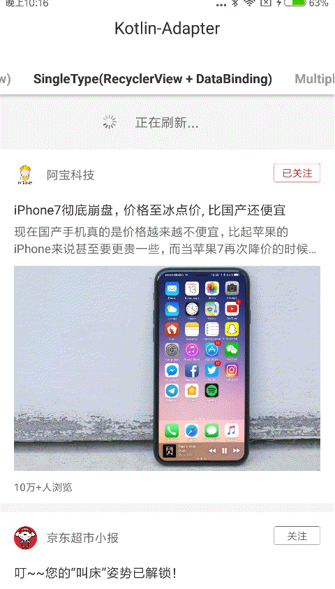
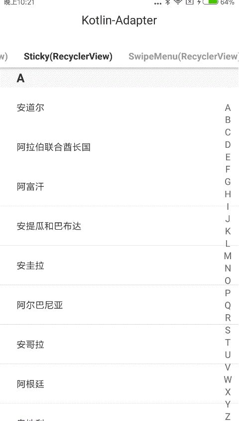
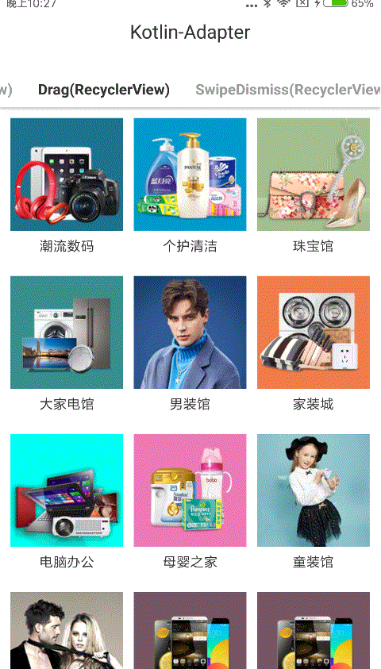

# kotlin-adapter
Base adapter for recyclerView，absListView, support multiple item view type, sticky header(selection), drag & drop, swipe dismiss

[Demo Download](https://www.pgyer.com/cCxm)

Features
========
- 代码优雅，无需重写Adapter, ViewHolder，通过链式调用实现适配器创建；
- 支持多种样式，解决视图复用导致的页面错乱问题；  
- 提供一系列回调方法，满足大部分场景下的业务需求； 
- 拓展ViewHolder，见[AdapterExtensions](adapter_core/src/main/kotlin/com/wuhenzhizao/adapter/extension/AdapterExtensions.kt), [ViewHolderExtensions](adapter_core/src/main/kotlin/com/wuhenzhizao/adapter/extension/ViewHolderExtensions.kt)，简化View数据更新操作；  
- 支持DataBinding；
- 封装了sticky header吸顶, swipe menu滑动菜单，拖拽等效果；

Preview
=======
- **Single Item View Type**

|ListView|RecyclerView|RecyclerView + DataBinding|
|:---:|:---:|:---:|
||||

- **Multiple Item View Type**

|ListView|RecyclerView|
|:---:|:---:|
|||


- **Extension(For RecyclerView)**

|Sticky Header|Swipe Menu|Drag & Drop|
|:---:|:---:|:---:|
||||

|Swipe Dismiss|
|:---:|
||

Setup
=====


 [  ](https://bintray.com/wuhenzhizao/maven/kotlin-adapter-core/_latestVersion) 
 [  ](https://bintray.com/wuhenzhizao/maven/kotlin-adapter-extension/_latestVersion)

```groovy
dependencies {
    // 核心依赖
    compile 'com.wuhenzhizao:kotlin-adapter-core:1.1.0'
    // 拓展效果依赖
    compile 'com.wuhenzhizao:kotlin-adapter-extension:1.1.0'
}
```

Usage(更多用法见example)
======================

**★ 提供了如下几种适配器实现**  

|类型|介绍|
|:---|:--|  
|[ListViewAdapter](adapter_core/src/main/kotlin/com/wuhenzhizao/adapter/ListViewAdapter.kt)|ListView适配器| 
|[RecyclerViewAdapter](adapter_core/src/main/kotlin/com/wuhenzhizao/adapter/RecyclerViewAdapter.kt)|RecyclerView适配器|  
|[RecyclerViewBindingAdapter](adapter_core/src/main/kotlin/com/wuhenzhizao/adapter/RecyclerViewBindingAdapter.kt)|RecyclerView适配器，使用DataBinding|  
|[StickyRecyclerViewAdapter](adapter_extension/src/main/kotlin/com/wuhenzhizao/adapter/extension/stickyHeader/StickyRecyclerViewAdapter.kt)|支持Sticky Header效果的RecyclerView适配器|  
|[SwipeMenuRecyclerViewAdapter](adapter_extension/src/main/kotlin/com/wuhenzhizao/adapter/extension/swipeMenu/SwipeMenuRecyclerViewAdapter.kt)|支持侧滑菜单效果的RecyclerView适配器|  
|[SwipeMenuStickyRecyclerViewAdapter](adapter_extension/src/main/kotlin/com/wuhenzhizao/adapter/extension/swipeMenu/SwipeMenuStickyRecyclerViewAdapter.kt)|同时支持Sticky Header和侧滑菜单效果的RecyclerView适配器（使用场景：京东购物车）|  
|[DragAndSwipeRecyclerViewAdapter](adapter_extension/src/main/kotlin/com/wuhenzhizao/adapter/extension/dragSwipeDismiss/DragAndSwipeRecyclerViewAdapter.kt)|支持Drag & Drop和Swipe Dismiss效果的RecyclerView适配器|
  
  
**★ 创建适配器（以RecyclerViewAdapter为例）** 
 
- [简单版本](adapter_example/src/main/kotlin/com/wuhenzhizao/adapter/example/ui/SingleTypeRecyclerViewFragment.kt)  

```kotlin
val adapter = RecyclerViewAdapter<Product>(context)
    .match(Product::class, R.layout.item_single_type_recycler_view)
    .attach(binding.rv)
```
	
- [完整版本](adapter_example/src/main/kotlin/com/wuhenzhizao/adapter/example/ui/MultipleTypeRecyclerViewFragment.kt)  

```kotlin
val adapter = RecyclerViewAdapter(context, list.provinceList)  
    .match(Time::class, R.layout.item_multiple_type_list_view_time)
    .match(TopNews::class, R.layout.item_multiple_type_list_view_top)
    .match(NormalNews::class, R.layout.item_multiple_type_list_view_normal)
    .holderCreateListener { holder ->
        // 布局创建时回调，用于对布局的处理，比如设置宽高(可省略)
    }
    .holderBindListener { holder, position ->
        // 布局绑定时回调，用于更新Item UI数据，也可以设置UI监听接口
        val province = adapter.getItem(position)
        holder.withView<TextView>(R.id.tv, { text = province.name })
                .withView<CheckBox>(R.id.cb, { isChecked = province.checked })
    }
    .clickListener { holder, position ->
        // Item最外层布局被点击回调(可省略)
    }
    .longClickListener { holder, position ->
        // Item最外层布局Long Click回调(可省略)
    }
    .attach(binding.lv)  // 绑定适配器到RecyclerView
```  
	
- [使用LayoutFactory替代match](adapter_example/src/main/kotlin/com/wuhenzhizao/adapter/example/ui/MultipleTypeRecyclerViewFragment.kt)   
  
```kotlin
val adapter = RecyclerViewAdapter<Any>(context)
    .layoutFactory {
        when (adapter.getItem(it)) {
             is BannerList -> R.layout.item_multiple_type_recycler_view_banner
             is Promotion -> R.layout.item_multiple_type_recycler_view_promotion
             is Divider -> R.layout.item_multiple_type_recycler_view_divider
             is HeaderLine -> R.layout.item_multiple_type_recycler_view_headine
             is HeaderLineProductList -> R.layout.item_multiple_type_recycler_view_headine_product
             is Recommend -> R.layout.item_multiple_type_recycler_view_recommend
             is RecommendProducts -> R.layout.item_multiple_type_recycler_view_recommend_item
             else -> {
                 0
             }
        }
    }
    .attach(binding.rv)
```  

- [DataBinding支持](adapter_example/src/main/kotlin/com/wuhenzhizao/adapter/example/ui/SingleTypeRecyclerViewBindingFragment.kt)
  
```kotlin
data class Content(val hasLiked: Int = 0) : BaseObservable() {
    fun getClickListener(): View.OnClickListener {
        return View.OnClickListener {
            // will be called when view clicked
        }
    }
}
```

```xml
<layout>
    <data>
        <variable
            name="vm"
            type="com.wuhenzhizao.adapter.example.bean.Content" />
    </data>
    ...
    <Button
        android:id="@+id/author_like"
        android:layout_width="50dp"
        android:layout_height="20dp"
        android:selected="@{vm.hasLiked == 1}"
        android:onClick="@{vm.clickListener}"
        android:text="@{vm.hasLiked == 1 ? @string/author_liked: @string/author_unlike}"
        android:textColor="@color/author_like_text_selector"
        android:textSize="11dp" />
    ...
</layout>
```

```kotlin
val adapter = RecyclerViewBindingAdapter<Content>(context)
    .match(Content::class, R.layout.item_single_type_recycler_view_binding, BR.vm)
    .attach(binding.rv)
```

**★ 更新Item数据**  

- 使用ViewHolder.withView()  

```kotlin
holder.withView<DraweeImageView>(R.id.left_iv, { 
        GImageLoader.displayUrl(context, this, item.leftProduct.imageUrl) })
    .withView<TextView>(R.id.left_name, { text = item.leftProduct.name })
    .withView<TextView>(R.id.left_price, { text = "¥ ${item.leftProduct.price}" })
    .withView<TextView>(R.id.left_reviews, { text = item.leftProduct.reviews })
```  

- 使用ViewHolder提供的方法(见[ViewHolderExtensions](adapter_core/src/main/kotlin/com/wuhenzhizao/adapter/extension/ViewHolderExtensions.kt)): 部分方法修改自[BaseRecyclerViewAdapterHelper](https://github.com/CymChad/BaseRecyclerViewAdapterHelper/blob/master/library/src/main/java/com/chad/library/adapter/base/BaseViewHolder.java)

```kotlin
holder.displayImageUrl(R.id.iv_sku_logo, { imageView -> })
    .setText(R.id.tv_sku_name, item.name)
    .setText(R.id.tv_sku_price, item.priceShow)
    .setTextColor(R.id.tv_sku_price, Color.RED)
    .setOnClickListener(R.id.rl_delete, {
        showToast("${item.name} is deleted")
        adapter.closeAllItems()
        adapter.removeItemAt(position)
    })
```

拓展
===  
**★ [创建支持Sticky Header效果的RecyclerView适配器](adapter_example/src/main/kotlin/com/wuhenzhizao/adapter/example/ui/StickyRecyclerViewFragment.kt)**  

```kotlin
val adapter = StickyRecyclerViewAdapter<Country>(context)
    .match(Country::class, R.layout.item_sticky_recycler_view)
    .matchHeader(Country::class, R.layout.item_sticky_recycler_view_header)
    .holderBindListener { holder, position ->
        val country = adapter.getItem(position)
        holder.withView<TextView>(R.id.country_name, { text = country.countryName })
    }
    .headerHolderBindListener { holder, position ->
        val country = adapter.getItem(position)
        holder.withView<TextView>(R.id.sticky_name, { text = country.letter })
    }
    .headerClickListener { holder, clickView, position ->
        showToast("sticky header clicked, headerId = ${adapter.getHeaderId(position)}")
    }
    .attach(binding.rv)
```  

**★ [创建支持SwipeMenu效果的RecyclerView适配器](adapter_example/src/main/kotlin/com/wuhenzhizao/adapter/example/ui/SwipeMenuRecyclerViewFragment.kt)**  

```kotlin
val SwipeMenuStickyRecyclerViewAdapter<StickyBean>(context)
    .match(Notice::class, R.layout.item_shopping_cart_notice)
    .match(Divider::class, R.layout.item_shopping_cart_divider)
    .holderBindListener { holder, position ->
        holder.withView<DraweeImageView>(R.id.iv_sku_logo, { GImageLoader.displayUrl(context, it, item.imgUrl) })
            .withView<EditText>(R.id.et_sku_quantity_input, { setText(item.num.toString()) })
            .withView<TextView>(R.id.tv_shopping_cart_delete, {
                setOnClickListener {
                    showToast("${item.name} is deleted")
                    adapter.closeAllItems()
                    adapter.removeItemAt(position)
                }
            })
    }
   
```  

**★ [创建支持拖拽效果的RecyclerView适配器](adapter_example/src/main/kotlin/com/wuhenzhizao/adapter/example/ui/SwipeMenuRecyclerViewFragment.kt)**  

```kotlin
val recyclerView = binding.rv
recyclerView.isLongPressDragEnable = true    // 开启长按拖拽
recyclerView.isItemViewSwipeEnable = true    // 开启Swipe Dismiss
recyclerView.dragDirection =                 // 设置拖拽方向
    ItemTouchHelper.LEFT or ItemTouchHelper.RIGHT or ItemTouchHelper.UP or ItemTouchHelper.DOWN

val adapter = DragAndSwipeRecyclerViewAdapter<Topic>(context)
    .match(Topic::class, R.layout.item_drag_recycler_view)
    .dragListener { from, target ->
        showToast("item draged, from ${from.adapterPosition} to ${target.adapterPosition}")
    }
    .swipeListener { holder, direction ->
        showToast("position ${viewHolder.adapterPosition} dismissed")
    }
    .attach(binding.rv)
``` 

# Next Target
- 使用装饰者模式改造kotlin-extension模块  

# Thanks
- [AndroidSwipeLayout](https://github.com/daimajia/AndroidSwipeLayout)
- [header-decor](https://github.com/edubarr/header-decor)  


技术交流
======
|QQ交流群|
|:---:|
||  


License
=======
```
Copyright 2017 wuhenzhizao

Licensed under the Apache License, Version 2.0 (the "License");
you may not use this file except in compliance with the License.
You may obtain a copy of the License at

   http://www.apache.org/licenses/LICENSE-2.0

Unless required by applicable law or agreed to in writing, software
distributed under the License is distributed on an "AS IS" BASIS,
WITHOUT WARRANTIES OR CONDITIONS OF ANY KIND, either express or implied.
See the License for the specific language governing permissions and
limitations under the License.
```
